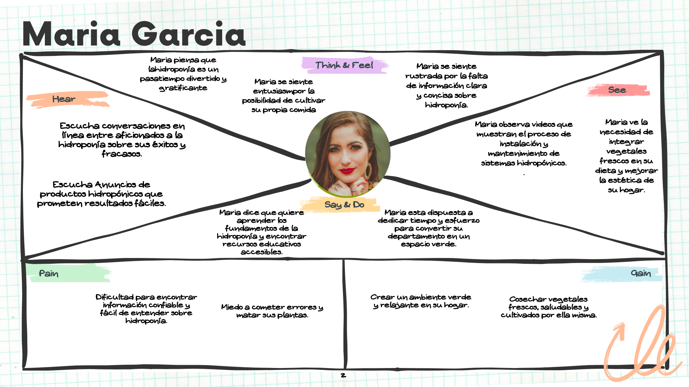
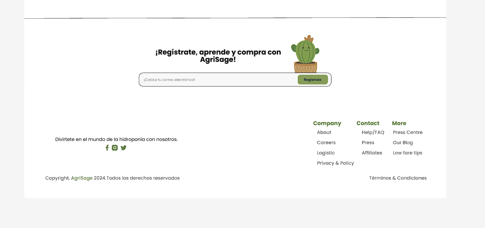

 

    <h1> Universidad Peruana de Ciencias Aplicadas </h1>
    

  

    Ingeniería de Software - 202401
     
    SW52 - Aplicaciones Web
     
    Docente: Juan Carlos Tinoco Licas
     
    Informe de Trabajo Final
     
    Startup: 
     
    Proyecto: AgriSage
  

   <table border="1">
        <tr> 
            <th>Alumno</th>
            <th>Codigo</th>
        </tr>
        <tr> 
            <td>Luis Angel Anampa Lavado</td>
            <td>u202218664</td>
        </tr>
        <tr> 
            <td>Pumahualcca Garcia, Diego Rodrigo</td>
            <td>u202219266</td>
        </tr>
        <tr> 
            <td>Justo Yauricasa,Alexander Paolo </td>
            <td>U20191C054</td>
        </tr>
        <tr> 
            <td>Mancilla Ordaya, Eduardo Vicente</td>
            <td>U202018894</td>
        </tr>
        <tr> 
            <td>Cisneros Tafur, Diego Rafael</td>
            <td>U20221A715</td>
        </tr>
    </table>

  

    Abril-2024
  

    

**Registro de Versiones del Informe**
|Versión|Fecha|Autor|Descripción de modificación|
|-------|-----|-----|---------------------------|
|V0.1|31/03/2024||Creación del repositorio|
|V0.2|02/04/2024|||
|V0.3|03/04/2024|||
|V0.4|09/04/2024|||
|V1.0|10/04/2024|||

# **Project Report Collaboration Insights**

URL Project Report (Github): https://github.com/AgriSage/Informe

_TB1_

Para el desarrollo de la entrega TB1, se opto por dividir el trabajo de la siguiente forma

| Integrante        | Actvidades Asignadas |
| ----------------- | -------------------- |
| Luis Anampa       |                      |
| Diego Pumahualcca |                      |
| Alexander Justo   |                      |
| Eduardo Mancilla  |                      |
| Diego Cisneros    |                      |

# Student Outcome

| Criterio Especifico                                                                                                                                                                                       | Acciones Realizadas                                                                                                                                                      | Conclusiones                                                                                                                                                                                                                                                                                    |
| --------------------------------------------------------------------------------------------------------------------------------------------------------------------------------------------------------- | ------------------------------------------------------------------------------------------------------------------------------------------------------------------------ | ----------------------------------------------------------------------------------------------------------------------------------------------------------------------------------------------------------------------------------------------------------------------------------------------- |
| Comunica oralmente sus  ideas y/o resultados con objetividad a  público de diferentes  especialidades y niveles  jerarquicos, en el marco del  desarrollo de un proyecto eningeniería.     | **Luis Anampa** TB1:  **Diego Pumahualcca** TB1:  **Alexander Justo** TB1:  **Eduardo Mancilla** TB1:  **Diego Cisnero** TB1:  | La comunicación oral ha sido efectiva dentro del equipo, permitiendo un intercambio fluido de ideas y una comprensión compartida de los objetivos del proyecto. Se continuará fomentando esta comunicación para mantener la colaboración y el progreso del trabajo.                             |
| Comunica en forma escrita ideas  y/o resultados con objetividad a  público de diferentes  especialidades y niveles  jerarquicos, en el marco del  desarrollo de un proyecto en ingeniería. | **Luis Anampa** TB1:  **Diego Pumahualcca** TB1: **Alexander Justo** TB1:   **Eduardo Mancilla** TB1:  **Diego Cisnero** TB1:     | La comunicación escrita ha sido crucial para documentar el progreso del proyecto y asegurar la comprensión de los entregables entre los miembros del equipo. Se seguirá manteniendo un enfoque claro y conciso en la comunicación escrita para garantizar la eficacia y la calidad del trabajo. |

# Contenido

- [Contenido](#contenido)
- [**Capítulo I: Introducción.**](#capítulo-i-introducción)
  - [**1.1 Startup Profile.**](#11--startup-profile)
    - [**1.1.1. Descripción del startup.**](#111-descripción-del-startup)
    - [**1.1.2. Perfiles de los integrantes del equipo.**](#112--perfiles-de-los-integrantes-del-equipo)
  - [**1.2. Solution Profile.**](#12-solution-profile)
    - [**1.2.1. Antecedentes y Problemática.**](#121-antecedentes-y-problemática)
    - [**1.2.2. Lean UX Process.**](#122-lean-ux-process)
      - [**1.2.2.1. Lean UX Problem Statements.**](#1221-lean-ux-problem-statements)
      - [**1.2.2.2. Lean UX Assumptions.**](#1222-lean-ux-assumptions)
      - [**1.2.2.3. Lean UX Hypothesis Statements.**](#1223-lean-ux-hypothesis-statements)
      - [**1.2.2.4. Lean UX Canvas.**](#1224-lean-ux-canvas)
  - [**1.3. Segmentos objetivo.**](#13-segmentos-objetivo)
- [**Capítulo II: Requirements Elicitation \& Analysis**](#capítulo-ii-requirements-elicitation--analysis)
  - [**2.1. Competidores.**](#21-competidores)
    - [**2.1.1. Análisis competitivo.**](#211-análisis-competitivo)
    - [**2.1.2. Estrategias y tácticas frente a competidores.**](#212-estrategias-y-tácticas-frente-a-competidores)
  - [**2.2. Entrevistas.**](#22-entrevistas)
    - [**2.2.1. Diseño de entrevistas.**](#221-diseño-de-entrevistas)
    - [**2.2.2. Registro de entrevistas.**](#222-registro-de-entrevistas)
    - [**2.2.3. Análisis de entrevistas.**](#223-análisis-de-entrevistas)
  - [**2.3. Needfinding.**](#23-needfinding)
    - [**2.3.1. User Personas.**](#231-user-personas)
    - [**2.3.2. User Task Matrix.**](#232-user-task-matrix)
    - [**2.3.3. User Journey Mapping**](#233-user-journey-mapping)
    - [**2.3.4. Empathy Mapping**](#234-empathy-mapping)
    - [**2.3.5. As-is Scenario Mapping**](#235-as-is-scenario-mapping)
  - [**2.4. Ubiquitous Language**](#24-ubiquitous-language)
- [**Capítulo III: Requirements Specification.**](#capítulo-iii-requirements-specification)
  - [**3.1. To-Be Scenario Mapping.**](#31-to-be-scenario-mapping)
  - [**3.2.User Stories.**](#32user-stories)
  - [**3.3. Impact Mapping.**](#33-impact-mapping)
  - [**3.4. Product Backlog.**](#34-product-backlog)
- [**Capítulo IV: Product Design.**](#capítulo-iv-product-design)
  - [**4.1. Style Guidelines.**](#41-style-guidelines)
    - [**4.1.1. General Style Guidelines.**](#411-general-style-guidelines)
    - [**4.1.2. Web Style Guidelines.**](#412-web-style-guidelines)
  - [**4.2. Information Architecture.**](#42-information-architecture)
    - [**4.2.1. Organization Systems.**](#421-organization-systems)
    - [**4.2.2. Labeling Systems.**](#422-labeling-systems)
    - [**4.2.3. SEO Tags and Meta Tags.**](#423-seo-tags-and-meta-tags)
    - [**4.2.4. Searching Systems.**](#424-searching-systems)
    - [**4.2.5. Navigation Systems.**](#425-navigation-systems)
  - [**4.3. Landing Page UI Design**](#43-landing-page-ui-design)
    - [**4.3.1. Landing Page Wireframe.**](#431-landing-page-wireframe)
    - [**4.3.2. Landing Page Mock-up.**](#432-landing-page-mock-up)
  - [**4.4. Web Applications UX/UI Design.**](#44-web-applications-uxui-design)
    - [**4.4.1. Web Applications Wireframes.**](#441-web-applications-wireframes)
    - [**4.4.2. Web Applications Wireflow Diagrams.**](#442-web-applications-wireflow-diagrams)
    - [**4.4.3. Web Applications Mock-ups.**](#443-web-applications-mock-ups)
    - [**4.4.4. Web Applications User Flow Diagrams.**](#444-web-applications-user-flow-diagrams)
  - [**4.5. Web Applications Prototyping.**](#45-web-applications-prototyping)
  - [**4.6. Domain-Driven Software Architecture**](#46-domain-driven-software-architecture)
    - [**4.6.1. Software Architecture Context Diagram.**](#461-software-architecture-context-diagram)
    - [**4.6.2. Software Architecture Container Diagrams.**](#462-software-architecture-container-diagrams)
    - [**4.6.3. Software Architecture Components Diagrams.**](#463-software-architecture-components-diagrams)
  - [**4.7. Software Object-Oriented Design.**](#47-software-object-oriented-design)
    - [**4.7.1. Class Diagrams.**](#471-class-diagrams)
    - [**4.7.2. Class Dictionary.**](#472-class-dictionary)
  - [**4.8. Database Design.**](#48-database-design)
    - [**4.8.1. Database Diagram.**](#481-database-diagram)
- [**Capítulo V: Product Implementation, Validation \& Deployment.**](#capítulo-v-product-implementation-validation--deployment)
  - [**5.1. Software Configuration Management.**](#51-software-configuration-management)
    - [**5.1.1. Software Development Environment Configuration.**](#511-software-development-environment-configuration)
    - [**5.1.2. Source Code Management.**](#512-source-code-management)
    - [**5.1.3. Source Code Style Guide \& Conventions.**](#513-source-code-style-guide--conventions)
    - [**5.1.4. Software Deployment Configuration.**](#514-software-deployment-configuration)
  - [**5.2. Landing Page, Services \& Applications Implementation.**](#52-landing-page-services--applications-implementation)
    - [**5.2.1. Sprint 1.**](#521-sprint-1)
      - [**5.2.1.1. Sprint Planning 1.**](#5211-sprint-planning-1)
      - [**5.2.1.2. Sprint Backlog 1.**](#5212-sprint-backlog-1)
      - [**5.2.1.3. Development Evidence for Sprint Review.**](#5213-development-evidence-for-sprint-review)
      - [**5.2.1.4. Testing Suite Evidence for Sprint Review.**](#5214-testing-suite-evidence-for-sprint-review)
      - [**5.2.1.5. Execution Evidence for Sprint Review.**](#5215-execution-evidence-for-sprint-review)
      - [**5.2.1.6. Services Documentation Evidence for Sprint Review.**](#5216-services-documentation-evidence-for-sprint-review)
      - [**5.2.1.7. Software Deployment Evidence for Sprint Review.**](#5217-software-deployment-evidence-for-sprint-review)
      - [**5.2.1.8. Team Collaboration Insights during Sprint.**](#5218-team-collaboration-insights-during-sprint)
- [**Capítulo VI: Conclusion.**](#capítulo-vi-conclusion)
- [**Capítulo VII: Bibliografia.**](#capítulo-vii-bibliografia)

  

# [**Capítulo I: Introducción.**](#capítulo-i-introducción)

## [**1.1 Startup Profile.**](#startup-profile)

### [**1.1.1. Descripción del startup.**](#descripción-del-startup)

AgriSage es una startup que nace con la finalidad de brindar conocimientos y habilidades a personas apasionadas por la hidroponía y la creación de granjas en casa. Ofrecemos una experiencia de aprendizaje integral que combina cursos en línea, recursos prácticos y una comunidad activa de entusiastas. Desde principiantes hasta expertos, nuestra plataforma proporciona las herramientas necesarias para adentrarse en el emocionante mundo de la agricultura en interiores. A través de contenido didáctico de alta calidad y asesoramiento personalizado, estamos transformando la forma en que las personas realizan el proceso de cultivo, promoviendo la sostenibilidad y la autosuficiencia en entornos urbanos y rurales por igual.

### [**1.1.2. Perfiles de los integrantes del equipo.**](#perfiles-de-los-integrantes-del-equipo)

<table align="center"  border="1" width="70%" style="text-align:center;">
    <tr align="center">
        <td rowspan="3">
            
        </td>
        <td align="left">
            <b>Nombre y Apellido:</b>
                         
            Eduardo Vicente, Mancilla Ordaya
        </td>
    </tr>
    <tr>
        <td align="left">
        <b>Carrera:</b>
         
        Ingeniería de Software
        </td>
    </tr>
    <tr>
        <td align="left">
        <b>Acerca de:</b>
         
        Soy una persona muy interesada en la programación, considero importante el trabajo en equipo ya que al colaborar se pueden idear soluciones innovadoras y efectivas a problemáticas de la vida real. Me caracterizo por tener un pensamiento analítico , y siempre busco dar distintos puntos de vista a la hora de realizar un trabajo. Estoy comprometido en seguir aprendiendo y contribuir con mi grupoo de trabajo para llevar el proyecto de la mejor manera.
        </td>
    </tr>
    <tr align="center">
        <td rowspan="3">
            
        </td>
        <td align="left">
            <b>Nombre y Apellido:</b>
                         
            Luis Angel Anampa Lavado
        </td>
    </tr>
    <tr>
        <td align="left">
        <b>Carrera:</b>
          
        Ingenieria de Software
        </td>
    </tr>
    <tr>
        <td align="left">
        <b>Acerca de:</b>
         
        Mi nombre es Angel Anampa y tengo 19 años. Actualmente estoy cursando la carrera de Ingeniería de Software en la UPC. Elegí dicha carrera porque soy una persona que le interesa mucho los temas que tienen que ver con tecnología , me gustan los videojuegos. Me considero una persona atenta, responsable , optimista que sabe solucionar los problemas. Como integrante del equipo me comprometo a apoyar al grupo en este trabajo.
        </td>
    </tr>
    <tr align="center">
        <td rowspan="3">
            
        </td>
        <td align="left">
            <b>Nombre y Apellido:</b>
                         
            Diego Rafael Cisneros Tafur
        </td>
    </tr>
    <tr>
        <td align="left">
        <b>Carrera:</b>
         
        Ingeniería de Software
        </td>
    </tr>
    <tr>
        <td align="left">
        <b>Acerca de:</b>
         
        Estudiante de 5to ciclo de Ingeniería de software. Me gusta la inteligencia artificial, programación competitiva, hacking ético, jugar videojuegos y leer. 
        Domino C++, Python, SQL y Rust. 
        También tengo conocimientos de  JS y TS y me apasiona el desarrollo frontend y backend.
        </td>
    </tr>
    <tr align="center">
        <td rowspan="3">
            
        </td>
        <td align="left">
            <b>Nombre y Apellido:</b>
                         
            NOMBRE Y APELLIDO
        </td>
    </tr>
    <tr>
        <td align="left">
        <b>Carrera:</b>
         
        CARRERA
        </td>
    </tr>
    <tr>
        <td align="left">
        <b>Acerca de:</b>
         
        COMPLETAR
        </td>
    </tr>
    <tr align="center">
        <td rowspan="3">
            
        </td>
        <td align="left">
            <b>Nombre y Apellido:</b>
                         
            NOMBRE Y APELLIDO
        </td>
    </tr>
    <tr>
        <td align="left">
        <b>Carrera:</b>
         
        CARRERA
        </td>
    </tr>
    <tr>
        <td align="left">
        <b>Acerca de:</b>
         
        COMPLETAR
        </td>
    </tr>
</table>

## [**1.2. Solution Profile.**](#solution-profile)

- **Nombre del Producto:**   

  Nuestra aplicación web recibe el nombre de “AgriSage”, ya que hacemos referencia a los cultivos que serán empleados por nuestros usuarios en la creación de sus proyectos caseros, quienes a su vez irán creciendo con nosotros, al adquirir conocimientos constantemente y mejorar sus habilidades en el sector agrícola.   

- **Descripción del Producto:**   

  Nuestra propuesta es un servicio novedoso e innovador, ofrecemos a nuestros usuarios la posibilidad de desarrollar sus propios proyectos domésticos basados en hidroponía, empezando con un nivel de principiantes hasta lograr convertirse en todos unos expertos en el tema. Nuestro servicio será intuitivo, sencillo y fácil de utilizar para cualquier persona que haga uso de la aplicación.   

- **Monetización:**   

Nuestra aplicación se enorgullece de ofrecer una extensa variedad de cursos especializados en hidroponía para satisfacer las necesidades de aprendizaje de nuestros usuarios. Desde técnicas básicas hasta avanzadas, nuestra plataforma ofrece una selección curada de cursos diseñados por expertos en la industria. Con un enfoque en la calidad del contenido y la accesibilidad, los usuarios pueden adquirir cursos individualmente para profundizar en áreas específicas de interés. Además, mediante la monetización exclusiva de la venta de cursos y productos especializados par introducirnos en el mundo de la hidroponía. Cada curso y cada producto estará cuidadosamente elaborado para proporcionar conocimientos prácticos y habilidades aplicables, lo que permite a los usuarios avanzar en su viaje hacia la maestría en la hidroponía con nuestro respaldo y apoyo continuo.
  

### [**1.2.1. Antecedentes y Problemática.**](#antecedentes-y-problemática)

- **What?**   

  El problema de nuestros usuarios es la falta de conocimiento acerca de la creación de una granja en casa, así como su mantención a lo largo del tiempo.  

- **When?**   

  El problema descrito se presenta cada vez que nuestros usuarios buscan información acerca de hidroponía, impidiendo que puedan tener su propias granjas domésticas.   

- **Where?**   

  El problema se encuentra en la poca información que se puede llegar a recopilar en distintos medios, y lo poco que se consigue resulta ser dificultoso de entender.   

- **Why?**   

  Usualmente los usuarios no logran encontrar la información necesaria sobre hidroponía y granjas domésticas, por lo que deben buscar por medio de internet, preguntar a familia o amigos para encontrar la mayor información posible.  

- **How?**   

  Resulta muy complicado para los principiantes poder encontrar los pasos necesarios para iniciar una granja en casa. Debido a esta problemática, surge nuestra aplicación, la cual servirá de apoyo a todos aquellos entusiastas a poner en práctica su pasión por la hidroponía y lograr su objetivo.   

- **How much?**   

  La problemática se origina debido a que existe poca información que podemos encontrar sobre hidroponía en el hogar, y la que se encuentra puede resultar complicada para las personas nuevas en el tema. Además, la información proporcionada en páginas web llega a presentarse de forma desordenada, lo que genera más obstáculos para los usuarios.   

### [**1.2.2. Lean UX Process.**](#lean-ux-process)

#### [**1.2.2.1. Lean UX Problem Statements.**](#lean-ux-problem-statements)

La hidroponía es una de las actividades que posee gran cantidad de practicantes, a la vez que existen personas que desean aventurarse en la hidroponía y la creación de granjas en casa. De acuerdo a El Comercio (2019), la hidroponía es el futuro de la agricultura sostenible, debido a que necesita 90% menos agua que los métodos de agricultura convencionales. Además, afirman que es un modelo que se adapta a espacios pequeños, permitiendo así una mayor eficiencia en la regulación de la nutrición y el crecimiento de cultivos se da con mayor rapidez. Aunque, a menudo, las personas que incursionan en la hidroponía se enfrentan a barreras que dificultan su acceso a la información y los recursos necesarios. La falta de una plataforma educativa integral y práctica hace que la curva de aprendizaje sea empinada y desafiante. Además, la falta de interacción significativa con una comunidad activa de personas con ideas afines puede hacer que este proceso se sienta aislado. Es por este motivo que, como startup, abordaremos la resolución de la siguiente cuestión: ¿Cómo podemos aplicar nuestro conocimiento tecnológico para ofrecer un servicio novedoso que pueda ofrecer la información necesaria para los principiantes en la hidroponía?

#### [**1.2.2.2. Lean UX Assumptions.**](#lean-ux-assumptions)

**Business outcomes:**

- Los usuarios de la aplicación están interesados en iniciar un proyecto doméstico de hidroponía.
- Los usuarios desean obtener guías ofrecidas por expertos calificados en el tema.
- Los usuarios desean una interfaz de aplicación intuitiva, responsive y fácil de usar para la búsqueda y visualización de los cursos.
- Los usuarios buscan funciones adicionales, como que se incluya servicios de equipamiento, nutrientes, y demás implementos.
- Los usuarios deben poder ver y analizar las opciones de forma clara y precisa.
- La aplicación debe ser compatible con múltiples navegadores modernos.
- Los usuarios están dispuestos a pagar por funciones premium o servicios adicionales en la aplicación.

**Users: assumptions**

- **¿Quién es el usuario?**

  Los usuarios interesados en la aplicación son aquellos que buscan toda la información necesaria para iniciar un proyecto propio sobre hidroponía casera y agricultura, además de buscar cursos y guías de expertos en las cuales puedan basarse y realizar de mejor manera su plan agrícola. Nuestros usuarios son: personas mayores de edad que deseen iniciar en la hidroponía, y expertos que desean brindar sus conocimientos a los principiantes.

- **¿Dónde encaja nuestro producto en su trabajo o vida?**

  Nuestra aplicación es aplicable tanto como un pasatiempo inicial, hasta convertirse en un proyecto y trabajo continuo que conlleva mayor inversión de tiempo.

- **¿Qué problema tiene nuestro producto? ¿Cómo se resuelve?**

  El problema que aborda nuestro producto es la dificultad de encontrar información acerca de hidroponía en casa y cómo iniciar tu propio proyecto. Se resuelve al proporcionar una plataforma que pueda conectar principiantes y expertos que puedan guiarlos a realizar su proyecto. Esto brinda la posibilidad de formar una comunidad en la cual puedan compartir experiencias, consejos, tutoriales y demás.

- **¿Cuándo y cómo es usado nuestro producto?**

  Nuestro producto se adecua a los usuarios, por lo que puede ser utilizado en las fechas que ellos prefieran, y cuando consideren que sea conveniente iniciar adecuadamente el proyecto que planean. Al mismo tiempo, los expertos también pueden decidir en qué momento compartir sus conocimientos, realizando buenos cursos para los principiantes.

- **¿Qué características son importantes?**

  La característica más importante es la posibilidad de crear comunidades, dentro de las cuales se pueden compartir diversas características entre los usuarios.

- **¿Cómo debe verse nuestro producto y comportarse?**

  Nuestro producto debe cumplir con su propósito sin presentar errores en su funcionamiento. El producto debe tener un uso sencillo, eficiente y ágil.

#### [**1.2.2.3. Lean UX Hypothesis Statements.**](#lean-ux-hypothesis-statements)

- Creemos que nuestra aplicación será de gran utilidad para las personas principiantes en el tema de hidroponía casera. Sabremos que tuvimos éxito cuando las reseñas positivas realizadas por los usuarios sean mayores al 80%.

- Creemos que los expertos en el tema podrán contribuir de manera significativa para el aprendizaje de los principiantes. Sabremos que tuvimos éxito cuando los cursos ofrecidos tengan inscritos más del 70% de usuarios.

- Creemos que nuestra aplicación será utilizada por personas mayores de 18 años, siendo este nuestro segmento objetivo. Sabremos que tuvimos éxito cuando el promedio de edad de los usuarios coincida con nuestro objetivo.

- Creemos que nuestra aplicación será sencilla e intuitiva de usar para nuestros usuarios. Sabremos que tuvimos éxito cuando en las encuestas los usuarios satisfechos sean más del 80%.

- Creemos que las comunidades serán una buena característica en la cual los usuarios puedan compartir sus experiencias y consejos entre sus proyectos. Sabremos que tuvimos éxito cuando la mayoría de los usuarios haga uso de esta característica.
-

#### [**1.2.2.4. Lean UX Canvas.**](#lean-ux-canvas)

## [**1.3. Segmentos objetivo.**](#segmentos-objetivo)

| Tipo de Usuario | Personas que deseen iniciar en la hidroponía                                                                                                                                                                                                                                          | Expertos que desean brindar sus conocimientos a los principiantes                                                                                                                                                                                                         |
| :-------------- | :------------------------------------------------------------------------------------------------------------------------------------------------------------------------------------------------------------------------------------------------------------------------------------ | :------------------------------------------------------------------------------------------------------------------------------------------------------------------------------------------------------------------------------------------------------------------------ |
| Geográfico      | País: Perú    Zona residencial: No es relevante, pueden ser de diferentes zonas del país.                                                                                                                                                                                       | País: Perú    Zona residencial: No es relevante, pueden ser de diferentes zonas del país.                                                                                                                                                                           |
| Psicográfico    | Clase Social: Mayormente se encuentran desde la clase media baja, hacia clases sociales más elevadas.    Estilo de vida: Son personas apasionadas por el tema de la agricultura y las granjas en casa, sin embargo no poseen los conocimientos para iniciar su propio proyecto. | Clase Social: Mayormente se encuentran desde la clase media baja, hacia clases sociales más elevadas.    Estilo de vida: Son personas dedicadas a la hidroponía, con cierto tiempo de experiencia en el tema, por lo que quieren ofrecer ayuda a los principiantes. |
| Demográfico     | Edad: Personas mayores de edad.    Nivel de Ingreso: No es relevante, ya que depende de los factores que se elijan.    Nacionalidad: Nacionalidad peruana. En el caso de ser extranjero, deberá identificarse con su pasaporte.                                           | Edad: Deben ser mayores de edad, preferiblemente mayores de 30 años.    Nacionalidad: Nacionalidad peruana. En el caso de ser extranjero, deberá identificarse con su pasaporte.    Estudios: Debe contar con secundaria completa o superior.                 |

  

# [**Capítulo II: Requirements Elicitation \& Analysis**](#capítulo-ii-requirements-elicitation--analysis)

## [**2.1. Competidores.**](#competidores)

 
Luego de realizar una investigación en el mercado, hemos encontrado tres proyectos que consideramos como potenciales competidores para AgriSage. Estos son:
  

- **AeroGarden:**
   

  Ofrece sistemas de jardinería hidropónica todo en uno diseñados para uso en interiores, facilitando el cultivo de una variedad de plantas con kits completos que incluyen semillas, nutrientes y sistemas de iluminación integrados.
   

  

  

- **GrowVeg:**
   

  Proporciona herramientas y recursos en línea para planificar y mantener jardines tanto en interiores como en exteriores, permitiendo a los usuarios diseñar, organizar y gestionar sus cultivos de manera eficiente y efectiva.
   

  

  

- **Hidroponika:**
   

  Ofrece soluciones completas de hidroponía para cultivo en interiores, incluyendo sistemas, equipos y suministros especializados, así como asesoramiento experto y recursos educativos para ayudar a los cultivadores a optimizar sus resultados.
   

  

  

### [**2.1.1. Análisis competitivo.**](#análisis-competitivo)

<table>
<tbody><tr><th colspan="7" valign="top"><b>Competitive Analysis Landscape</b></th></tr><tr><td colspan="2" rowspan="2">¿Por qué llevar a cabo este análisis?</td><td colspan="5">Escriba en el recuadro la pregunta que busca responder o el objetivo de este análisis.</td></tr><tr><td colspan="5">Este análisis se concretó teniendo como finalidad el poder identificar a nuestros potenciales competidores e idear estrategias y tácticas para diferenciarnos de ellos.</td></tr><tr><td colspan="3">Nuestro Producto / Competidores</td><td colspan="1" valign="top" style="font-weight: bold;">AgriSage </td><td colspan="1" valign="top" style="font-weight: bold;">Hidroponika </td><td colspan="1" valign="top" style="font-weight: bold;">GrowVeg </td><td colspan="1" valign="top" style="font-weight: bold;">AeroGarden </td></tr><tr><td colspan="1" rowspan="2">Perfil</td><td colspan="2">Overview</td><td colspan="1" valign="top">Aplicación web donde los clientes podrán informarse acerca de la hidroponía, mantenerse informado cada dia sobre diversos temas de la hidroponía y poder realizar cursos interactivos donde aprenda distintas técnicas o materiales a usar. Además de ofrecer variedad de productos dentro de la aplicación.</td><td colspan="1" valign="top">Es una página web que cuenta con una gran variedad de productos y servicios relacionados a la hidroponía, de gran calidad y para distintos lugares.Además posee distintos cursos para iniciar en la hidroponía.</td><td colspan="1" valign="top">Es una página web que ofrece distintos tipos de información sobre agricultura.  Ofrecen capacitaciones y cursos donde explican distintos tipos de métodos a utilizar en la agricultura. Estos cursos los dictan de manera presencial o virtual dependiendo del área que dicten.</td><td colspan="1" valign="top">Es una página web que ofrece distintos productos para la hidroponia como nutrientes para las plantas, huertas donde irán instaladas estas plantas y semillas de distintos tipos.</td></tr><tr><td colspan="2">Ventaja competitiva</td><td colspan="1" valign="top">Una mejor variedad de productos acorde a la economía de las personas y a los distintos lugares del Perú. Además de un continuo seguimiento de nuestros clientes para poder aclarar alguna duda o problema que pueda surgir.</td><td colspan="1" valign="top">Una gran cantidad de productos, packs, soluciones y demás para la hidroponia. Tiene una sólida interfaz donde explican los servicios que ofrece la empresa y los beneficios de realizar hidroponia.</td><td colspan="1" valign="top">Una ventaja que ellos tienen a diferencia de otros es la gran cantidad de cursos que dictan, esto hace que muchas personas elijan sus servicios para aprender más acerca de distintos temas de agricultura y también sobre de la hidroponia.</td><td colspan="1" valign="top">Gran variedad de semillas y nutrientes para la hidroponia. Esto hace que sean un lugar concurrido para las personas que tengan este tipo de huertos.</td></tr><tr><td colspan="1" rowspan="2">Perfil de Marketing</td><td colspan="2">Mercado objetivo</td><td colspan="1" valign="top">Personas de todo el Perú que quieran comenzar a utilizar la técnica de hidroponía para cultivar en sus casas o personas que necesitan materiales para seguir ciudadano sus cultivos</td><td colspan="1" valign="top">Personas que quieran obtener sus productos o empezar en la hidroponía en sus hogares u otros lugares.</td><td colspan="1" valign="top">Personas que estén interesadas en aprender más sobre la hidroponía, dispuestos a llevar cursos y asistir en charlas que Intagri ofrece.</td><td colspan="1" valign="top">Personas que se dedican a cultivar plantas con la técnica de hidroponía.</td></tr><tr><td colspan="2">Estrategias de marketing</td><td colspan="1" valign="top">Publicidad a través de redes sociales</td><td colspan="1" valign="top">En las principales redes sociales.</td><td colspan="1" valign="top">En las principales redes sociales, linkedin y en empresas aliadas como Fertilab y Proain.</td><td colspan="1" valign="top">Publicidad a través de las principales redes sociales</td></tr><tr><td colspan="1" rowspan="3">Perfil de Producto</td><td colspan="2">Productos &amp; Servicios</td><td colspan="1" valign="top">Brindar un servicio de calidad mediante la información que mostraremos en nuestra página, La creación de cursos didácticos de distintos temas de la hidroponía, además de la creación de comunidades donde las personas puedan contar sus experiencias o recomendar distintas cosas.</td><td colspan="1" valign="top">Gran variedad de productos desde nutrientes para las plantas hasta hidro huertos de distintos tamaños y para distintos tipos de plantas.</td><td colspan="1" valign="top">Los productos que ellos ofrecen son los cursos y capacitaciones sobre distintos temas acerca de la agricultura.</td><td colspan="1" valign="top">Gran variedad de productos desde nutrientes para las plantas hasta huertos de distintos tamaños y para distintos tipos de plantas.</td></tr><tr><td colspan="2">Precios &amp; Costos</td><td colspan="1" valign="top">Los precios y costos por nuestros cursos se mostrarán en la pantalla de compra del producto. Asimismo trataremos de mantener los precios lo más accesible para todo público.</td><td colspan="1" valign="top">Los costos varían desde los más baratos que son las soluciones desde los 20 soles hasta los más caros que son los hidro huertos que pueden pasar los 1000 soles.</td><td colspan="1" valign="top">Sus precios varían entre los cursos que son los más cómodos hasta los diplomados internacionales que valen mucho dinero.</td><td colspan="1" valign="top">Los costos varían desde los más baratos que son los nutrientes y semillas hasta los más caros que son los huertos que pueden costar una gran cantidad de dinero dependiendo del tamaño de estos.</td></tr><tr><td colspan="2">Canales de distribución (Web y/o Móvil)</td><td colspan="1" valign="top">Se contará con una página web en donde se encontrará todo lo que ofrecemos e información acerca de nosotros </td><td colspan="1" valign="top">Se hacen envíos a todo el Perú mediante empresas de courier tanto para Lima metropolitana hasta los distintos departamentos del país.</td><td colspan="1" valign="top">La mayoría de cursos que dictan son virtuales pero los seminarios o congresos que ellos dicten son presenciales.</td><td colspan="1" valign="top">Ofrecen sus servicios por medio de empresas de envio internacional.</td><tr></tr><td colspan="1" rowspan="5">Análisis SWOT</td></td></tr><tr><td colspan="2">Fortalezas</td><td colspan="1" valign="top">Brindar información de distintos temas sobre la hidroponía, además de estar validadas por un especialista. Comunicación constante con los clientes.</td><td colspan="1" valign="top">Una gran variedad de productos para ofrecer a todos sus clientes.</td><td colspan="1" valign="top">Una gran variedad de cursos de distintos temas que pueden atraer a distintas personas. Capacitaciones y ponencias de manera presencial hacen que sean más reconocidos por sus demás competidores.</td><td colspan="1" valign="top">Gran variedad de semillas para la plantación de estas, distintos nutrientes que ayudan a la planta a crecer y gran variedad de huertos de distintos tamaños y para distintos propocitos.</td></tr><tr><td colspan="2">Debilidades</td><td colspan="1" valign="top">Falta de credibilidad por ser una startup nueva y no ser tan reconocida en el medio.</td><td colspan="1" valign="top">Falta de comunicación con los clientes. Sus únicos medios de comunicación son las redes sociales y whatsapp, por lo que se puede tardar a la hora de responder algún mensaje.</td><td colspan="1" valign="top">Al tener un catálogo muy amplio de cursos y temas que ofrecen, no pueden enfocarse en un tema en específico por lo que algunas ocasiones no resolverán la duda al cliente.</td><td colspan="1" valign="top">Algunas personas no podrán conocer qué tipos de nutrientes necesitan para sus plantas o que tipos de huertas se acomodan más a su lugar de plantación.</td></tr><tr><td colspan="2">Oportunidades</td><td colspan="1" valign="top">Falta de información por especialistas en el tema.. Falta de plataformas que ofrezcan servicios de hidroponía a nivel nacional.</td><td colspan="1" valign="top">Falta de lugares o webs donde una persona pueda encontrar todo lo relacionado a la hidroponía, soluciones, semillas, huertos, etc.</td><td colspan="1" valign="top">Falta de lugares donde dicten cursos de una gran variedad de temas.</td><td colspan="1" valign="top">Al tener una gran variedad de productos podrán satisfacer las necesidades de sus clientes.</td></tr><tr><td colspan="2">Amenazas</td><td colspan="1" valign="top">Las personas en primera instancia no confiarán en nosotros por ser una nueva empresa. Falta de socios los cuales nos puedan ayudar en el tema económico de la startup.</td><td colspan="1" valign="top">Algunas personas no contarán con el presupuesto suficiente para poder comprar las estaciones esenciales donde cultivar las plantas utilizando esta técnica.</td><td colspan="1" valign="top">Algunas personas no podrán acceder a sus cursos presenciales por falta de tiempo o por la locación de estas capacitaciones.</td><td colspan="1" valign="top">Los mismos productos podrán ser encontrados en otros tipos de páginas</td></tr></tbody></table>

### [**2.1.2. Estrategias y tácticas frente a competidores.**](#estrategias-y-tácticas-frente-a-competidores)

Diferenciación de productos/servicios:
AgriSage se destacará en el mercado al ofrecer una experiencia de aprendizaje integral y personalizada en hidroponía y agricultura en interiores. Además de proporcionar contenido educativo de alta calidad y recursos prácticos respaldados por asesoramiento personalizado, la plataforma ofrecerá kits de inicio completos para aquellos que deseen comenzar su aventura en la agricultura en interiores de manera fácil y conveniente, a su vez contará con una tienda virtual dentro de la aplicación, y una comunidad de usuarios que contribuira a ella. Estos kits incluirán todo lo necesario para comenzar a cultivar, desde semillas hasta equipos básicos. AgriSage se comprometerá a brindar a los usuarios una solución integral que abarque desde la educación hasta la práctica, simplificando así el proceso de cultivo en interiores.

Marketing y posicionamiento de marca:
AgriSage se promocionará como la plataforma preferida para aquellos interesados en la hidroponía y la agricultura en interiores, ofreciendo una amplia gama de productos y servicios que satisfagan las necesidades de los usuarios. Además del contenido educativo y los kits de inicio, la plataforma también albergará una tienda en línea integrada donde los usuarios podrán comprar suministros, equipos y productos relacionados con la agricultura en interiores. Esta estrategia de marketing ampliará aún más la oferta de AgriSage, posicionándola como un destino único y completo para los entusiastas de la jardinería en interiores.

Innovación continua y mejora de productos:
AgriSage se comprometerá a mantenerse a la vanguardia de la innovación en hidroponía y agricultura en interiores, no solo en términos de educación y recursos, sino también en la oferta de productos y servicios. Se realizarán actualizaciones regulares en la tienda en línea de AgriSage para agregar nuevos productos, mejorar la selección existente y adaptarse a las necesidades cambiantes de los usuarios. Se buscará colaborar con fabricantes y proveedores de renombre para ofrecer productos de alta calidad y tecnología avanzada que mejoren la experiencia de cultivo en interiores de los usuarios. Esta estrategia garantizará que AgriSage continúe siendo relevante y atractivo para su base de usuarios, promoviendo así el crecimiento y la fidelización del cliente.

## [**2.2. Entrevistas.**](#entrevistas)

### [**2.2.1. Diseño de entrevistas.**](#diseño-de-entrevistas)

En esta sección se han definido una cierta cantidad de preguntas para nuestros segmentos objetivos. Esta información se usará en el desarrollo de nuestra solución.

**Adquisición de información general**

1. ¿Cómo te llamas?
2. ¿Cuántos años tienes?
3. ¿Cuál es su ocupación?
4. Actualmente, ¿en qué lugar reside?

**Segmento 1: Personas que deseen iniciar en la hidroponía**

1. ¿Qué te motiva a interesarte en la hidroponía?
2. ¿Cuáles son tus principales objetivos al comenzar a explorar la hidroponía?
3. ¿Qué tipo de información o recursos necesitas para comenzar con éxito en la hidroponía?
4. ¿Qué obstáculos o desafíos crees que podrías enfrentar al iniciarte en la hidroponía?
5. ¿Qué te gustaría aprender o encontrar en una plataforma como AgriSage?
6. ¿Tienes alguna experiencia previa en jardinería o cultivo de plantas?
7. ¿Qué tipo de personalidad tienes y cómo influye en tu interés por la hidroponía?
8. ¿Qué dispositivos prefieres utilizar para acceder a información y recursos sobre hidroponía?
9. ¿Qué canales digitales sueles utilizar para buscar información relacionada con la jardinería o la agricultura?
10. ¿Cuáles son tus principales objetivos y frustraciones relacionadas con la jardinería en interiores?

**Segmento 2: Expertos en hidroponía que puedan brindar conocimientos**

1. ¿Cuál es tu experiencia y trayectoria en el campo de la hidroponía?
2. ¿Qué te motiva a compartir tus conocimientos y experiencia con otros?
3. ¿Cuáles crees que son los principales desafíos que enfrentan las personas al iniciarse en la hidroponía?
4. ¿Qué tipo de información o recursos consideras más útiles para quienes están comenzando en la hidroponía?
5. ¿Qué habilidades o conocimientos consideras esenciales para tener éxito en la hidroponía?
6. ¿Cuál es tu experiencia previa en enseñanza o asesoramiento en hidroponía?
7. ¿Qué tipo de personalidad tienes y cómo influye en tu capacidad para enseñar o asesorar a otros?
8. ¿Qué dispositivos prefieres utilizar para compartir información y recursos sobre hidroponía?
9. ¿Qué canales digitales sueles utilizar para interactuar con la comunidad de hidroponía o la comunidad de jardineros en general?
10. ¿Cuáles son tus principales objetivos y frustraciones en relación con la enseñanza o asesoramiento en hidroponía?

### [**2.2.2. Registro de entrevistas.**](#registro-de-entrevistas)

### [**2.2.3. Análisis de entrevistas.**](#análisis-de-entrevistas)

## [**2.3. Needfinding.**](#needfinding)

### [**2.3.1. User Personas.**](#user-personas)

Los User Personas son necesarios para la formación de este proyecto, ya que brindan una perspectiva completa de los usuarios clave. Estos perfiles detallados permiten a la startup diseñar una plataforma y experiencia de aprendizaje altamente enfocada y personalizada, abordando de manera efectiva los desafíos específicos de cada segmento objetivo: desde brindar recursos claros y accesibles a principiantes, hasta ofrecer herramientas para que los expertos compartan su conocimiento.

**User Persona del segmento: Personas que deseen iniciar en la hidroponía**

  

**User Persona del segmento: Expertos que desean brindar sus conocimientos a los principiantes**

  

 

### [**2.3.2. User Task Matrix.**](#user-task-matrix)

En esta seccion, se describen las tareas típicas que realizan los dos segmentos objetivos. Se evalúa la frecuencia y la severidad de cada tarea de los user persona, lo que ayuda a priorizar y entender cuáles son las áreas clave en las que el producto podría influir.

**Segmento Objetivo:** Personas que deseen iniciar en la hidroponía

|                               Tarea                               |  Frecuencia  | Severidad |
| :---------------------------------------------------------------: | :----------: | :-------: |
|          Aprender los conceptos básicos de la hidroponía          | Casi siempre |   Alta    |
|               Buscar kits de inicio para hidroponía               | Casi siempre |   Media   |
|         Obtener orientación sobre cómo cultivar con éxito         |   A veces    |   Alta    |
|              Solucionar problemas durante el cultivo              |   Rara vez   |   Alta    |
|  Investigar sobre los diferentes tipos de sistemas de hidroponía  | Casi siempre |   Media   |
|    Comprar suministros y equipos para su sistema de hidroponía    |   A veces    |   Alta    |
|          Registrarse en cursos en línea sobre hidroponía          |   A veces    |   Media   |
|  Mantener registros y hacer seguimiento del progreso del cultivo  |   A veces    |   Alta    |
| Establecer un calendario de tareas para el cuidado de las plantas |   A veces    |   Media   |

**Segmento Objetivo:** Expertos que desean brindar sus conocimientos a los principiantes

| Tareas                                                               | Frecuencia   | Severidad |
| -------------------------------------------------------------------- | ------------ | --------- |
| Compartir su experiencia y conocimientos en hidroponía               | Casi siempre | Alta      |
| Buscar recursos educativos avanzados                                 | Casi siempre | Media     |
| Participar en comunidades de hidroponía                              | A veces      | Alta      |
| Promover prácticas agrícolas sostenibles                             | Rara vez     | Alta      |
| Dar feedback sobre los productos y equipos de hidroponía             | A veces      | Alta      |
| Investigar nuevas técnicas y tecnologías en hidroponía               | Casi siempre | Media     |
| Asistir a conferencias y eventos relacionados con la hidroponía      | Rara vez     | Alta      |
| Realizar experimentos y pruebas con nuevos sistemas de cultivo       | A veces      | Alta      |
| Escribir artículos o guías sobre hidroponía para su blog o sitio web | Rara vez     | Alta      |

### [**2.3.3. User Journey Mapping**](#user-journey-mapping)

**User Journey Mapping del segmento: Personas que deseen iniciar en la hidroponía**

  

**User Journey Mapping del segmento: Expertos que desean brindar sus conocimientos a los principiantes**

  

### [**2.3.4. Empathy Mapping**](#empathy-mapping)

Los Mapas de Empatía son fundamentales para el proyecto AgriSage, ya que facilitan una comprensión profunda y completa de las experiencias, pensamientos y emociones de los usuarios clave. Estos mapas brindan una visión integral de cómo los usuarios perciben, sienten, observan, escuchan, expresan y se comportan en relación con la agricultura interior y la hidroponía. Al ofrecer una representación visual y detallada de sus puntos de vista y necesidades, los Mapas de Empatía orientan el desarrollo de la plataforma asegurando que se aborden los problemas reales y se satisfagan las expectativas de los usuarios.

**Empathy Mapping del segmento: Personas que deseen iniciar en la hidroponía**

  

**Empathy Mapping del segmento: Expertos que desean brindar sus conocimientos a los principiantes**

  

### [**2.3.5. As-is Scenario Mapping**](#as-is-scenario-mapping)

**As-is Scenario Mapping del segmento: Personas que deseen iniciar en la hidroponía**

  

**As-is Scenario Mapping del segmento: Expertos que desean brindar sus conocimientos a los principiantes**

  

## [**2.4. Ubiquitous Language**](#ubiquitous-language)

# [**Capítulo III: Requirements Specification.**](#capítulo-iii-requirements-specification)

## [**3.1. To-Be Scenario Mapping.**](#to-be-scenario-mapping)

## [**3.2.User Stories.**](#user-stories)

## [**3.3. Impact Mapping.**](#impact-mapping)

## [**3.4. Product Backlog.**](#product-backlog)

# [**Capítulo IV: Product Design.**](#capítulo-iv-product-design)

## [**4.1. Style Guidelines.**](#style-guidelines)

### [**4.1.1. General Style Guidelines.**](#general-style-guidelines)

### [**4.1.2. Web Style Guidelines.**](#web-style-guidelines)

## [**4.2. Information Architecture.**](#information-architecture)

### [**4.2.1. Organization Systems.**](#organization-systems)

La página de aterrizaje y las secciones de la aplicación se crearán utilizando una estructura visual jerárquica en el sitio web.
Esto permitirá la colocación adecuada de cada elemento necesario para este desarrollo.
Se espera que se tengan en cuenta elementos como las etiquetas, las especificaciones de pantalla y la resolución.
Además, los iconos se diseñarán utilizando una matriz, lo que aumentará la visibilidad de los detalles y permitirá mantener un proceso ordenado en todo momento.

#### **El público objetivo: Personas que quieran iniciarse en el cultivo hidropónico.**

**Jerarquía:**

Aplicando los filtros adecuados, los vídeos, capítulos, cursos o temas seleccionados pueden aparecer en el orden correcto, es decir, los elementos con mayor coincidencia aparecerán primero y así sucesivamente. El usuario tendrá la posibilidad de elegir el resultado que más le atraiga.

**Secuencial:**

Cuando se necesita crear una cuenta para utilizar la aplicación, la información que aparece en pantalla debe seguir una secuencia, ya que se deben respetar los pasos necesarios para que la tarea se complete.

**Matricial:**

En la configuración de la cuenta, el usuario podrá configurar los diferentes aspectos de la cuenta según sus preferencias, mostrando las secciones divididas en apartados.

#### **Segmento Objetivo: Expertos interesados en brindar sus servicios**

**Jerarquía:**

Especialización:

Los expertos pueden ser clasificados según su área de especialización, como “Nutricionistas”, “Ingenieros Agrónomos”, “Diseñadores de Sistemas Hidropónicos”, etc.
Experiencia:

Puedes organizar a los expertos según su nivel de experiencia, desde principiantes hasta veteranos.
Calificaciones y Reseñas:

Si hay un sistema de calificación o reseñas, puedes destacar a los expertos mejor evaluados.

**Secuencial:**

Búsqueda de Expertos:

El usuario busca expertos en el área específica que necesita.
Perfil del Experto:

Al seleccionar un experto, se muestra su perfil completo, incluyendo su experiencia, habilidades y reseñas.
Contacto o Contratación:

El usuario puede comunicarse con el experto o contratar sus servicios directamente desde la plataforma.

**Matricial:**

En la configuración de la cuenta, el usuario podrá configurar los diferentes aspectos de la cuenta según sus preferencias, mostrando las secciones divididas en apartados.

### [**4.2.2. Labeling Systems.**](#labeling-systems)

Tendremos un sistema de etiquetado en la sección inicial de la Landing Page en la que se evidencia informacion clara y presisa de los cursos y guías que se ofrecen en la aplicación.

Home: En esta sección se muestra la sección inicial de la Landing Page, en la que se ofrece la bienvenida a los posibles usuarios, junto a una frase que representa al proyecto.
Servicios: En esta sección se describen las características que los usuarios podrán encontrar al hacer uso de nuestra aplicación.
Quiénes somos: En esta sección el cliente puede observar información acerca de nuestro equipo de desarrollo y una descripción breve de nuestro objetivo.
Contacto: En esta sección se muestra la información de contacto de la empresa, como el correo electrónico, número de teléfono y dirección física.
Cursos: En esta sección se muestra la información acerca de los cursos que se ofrecen en la aplicación, junto a una breve descripción de cada uno.

### [**4.2.3. SEO Tags and Meta Tags.**](#seo-tags-and-meta-tags)

En esta seción se describen las etiquetas SEO y Meta Tags que se utilizarán en la aplicación para mejorar la visibilidad en los motores de búsqueda.

Para el Landing Page:

- **Title:** "AgriSage - Aprende a cultivar en casa con hidroponía"

- **Description:** "AgriSage es una plataforma educativa que te enseña a cultivar en casa con hidroponía. Aprende a cultivar tus propias plantas de forma sostenible y eficiente."

- **Keywords:** "hidroponía, cultivo en casa, agricultura urbana, jardinería en interiores, plantas en casa"

- **Autor:** AgriSage

Para la aplicación web:

- **Title:** "Inicio Agri - Aprende a cultivar en casa con hidroponía"

- **Description:** "Aquí encontrarás cursos, guías y recursos para aprender a cultivar en casa con hidroponía. Conviértete en un experto en jardinería en interiores."

- **Keywords:** "hidroponía, cultivo en casa, agricultura urbana, jardinería en interiores, plantas en casa, cursos de hidroponía, guías de cultivo, recursos para jardinería"

- **Autor:** AgriSage

### [**4.2.4. Searching Systems.**](#searching-systems)

En la aplicación se implementará un sistema de búsqueda que permitirá a los usuarios encontrar rápidamente los cursos, guías y recursos que necesitan. El sistema de búsqueda se basará en palabras clave y categorías, y mostrará resultados relevantes de acuerdo con los términos de búsqueda del usuario.

- **Landing Page**

  En la Landing Page, el sistema de búsqueda permitirá a los usuarios buscar cursos, guías y recursos por palabras clave, categorías y temas. Los resultados de la búsqueda se mostrarán en una lista ordenada por relevancia, y los usuarios podrán hacer clic en los resultados para obtener más información.

- **Aplicación Web**

  En la aplicación web, el sistema de búsqueda permitirá a los usuarios buscar cursos, guías y recursos por palabras clave, categorías y temas. Los resultados de la búsqueda se mostrarán en una lista ordenada por relevancia, y los usuarios podrán hacer clic en los resultados para obtener más información.

### [**4.2.5. Navigation Systems.**](#navigation-systems)

La landing Page de AgriSage contará con un sistema de navegación sencillo y claro, que permitirá a los usuarios encontrar fácilmente la información que buscan. La navegación se organizará en categorías y subcategorías, y se mostrará de forma clara y concisa en la parte superior de la página.

- Iniciar sessión Registrarse: Los usuarios podrán iniciar sesión o registrarse en la aplicación web desde cualquier página de la Landing Page, utilizando un formulario de inicio de sesión o registro que se mostrará en la parte superior de la página.

- Barra de navegación: La barra de navegación de la Landing Page incluirá las siguientes secciones: Inicio, Servicios, Quiénes somos, Contacto, Cursos. Cada sección estará claramente etiquetada y será fácilmente accesible desde cualquier página de la Landing Page.

- Menú desplegable: En la aplicación web, el menú desplegable permitirá a los usuarios acceder a las diferentes secciones de la aplicación de forma rápida y sencilla. Los usuarios podrán navegar por las diferentes categorías y subcategorías de cursos, guías y recursos, y encontrar la información que necesitan de forma eficiente.

## [**4.3. Landing Page UI Design**](#landing-page-ui-design)

### [**4.3.1. Landing Page Wireframe.**](#landing-page-wireframe)

Se empleará el patrón Z en la página de inicio para dirigir a los usuarios de una forma más rápida al contenido importante.
Comienza con el logo luego las opciones de importancia.
Se utilizará un diseño de cuadrícula para organizar los elementos de la página de inicio de forma clara y ordenada.

  
  

### [**4.3.2. Landing Page Mock-up.**](#landing-page-mock-up)

  
  
  
  
  

## [**4.4. Web Applications UX/UI Design.**](#web-applications-uxui-design)

### [**4.4.1. Web Applications Wireframes.**](#web-applications-wireframes)

### [**4.4.2. Web Applications Wireflow Diagrams.**](#web-applications-wireflow-diagrams)

### [**4.4.3. Web Applications Mock-ups.**](#web-applications-mock-ups)

### [**4.4.4. Web Applications User Flow Diagrams.**](#web-applications-user-flow-diagrams)

## [**4.5. Web Applications Prototyping.**](#web-applications-prototyping)

## [**4.6. Domain-Driven Software Architecture**](#domain-driven-software-architecture)

### [**4.6.1. Software Architecture Context Diagram.**](#software-architecture-context-diagram)

### [**4.6.2. Software Architecture Container Diagrams.**](#software-architecture-container-diagrams)

### [**4.6.3. Software Architecture Components Diagrams.**](#software-architecture-components-diagrams)

## [**4.7. Software Object-Oriented Design.**](#software-object-oriented-design)

### [**4.7.1. Class Diagrams.**](#class-diagrams)

### [**4.7.2. Class Dictionary.**](#class-dictionary)

## [**4.8. Database Design.**](#database-design)

### [**4.8.1. Database Diagram.**](#database-diagram)

# [**Capítulo V: Product Implementation, Validation \& Deployment.**](#capítulo-v-product-implementation-validation--deployment)

## [**5.1. Software Configuration Management.**](#software-configuration-management)

### [**5.1.1. Software Development Environment Configuration.**](#software-development-environment-configuration)

### [**5.1.2. Source Code Management.**](#source-code-management)

### [**5.1.3. Source Code Style Guide \& Conventions.**](#source-code-style-guide--conventions)

### [**5.1.4. Software Deployment Configuration.**](#software-deployment-configuration)

## [**5.2. Landing Page, Services \& Applications Implementation.**](#landing-page-services--applications-implementation)

### [**5.2.1. Sprint 1.**](#sprint-1)

#### [**5.2.1.1. Sprint Planning 1.**](#sprint-planning-1)

#### [**5.2.1.2. Sprint Backlog 1.**](#sprint-backlog-1)

#### [**5.2.1.3. Development Evidence for Sprint Review.**](#development-evidence-for-sprint-review)

#### [**5.2.1.4. Testing Suite Evidence for Sprint Review.**](#testing-suite-evidence-for-sprint-review)

#### [**5.2.1.5. Execution Evidence for Sprint Review.**](#execution-evidence-for-sprint-review)

#### [**5.2.1.6. Services Documentation Evidence for Sprint Review.**](#services-documentation-evidence-for-sprint-review)

#### [**5.2.1.7. Software Deployment Evidence for Sprint Review.**](#software-deployment-evidence-for-sprint-review)

#### [**5.2.1.8. Team Collaboration Insights during Sprint.**](#team-collaboration-insights-during-sprint)

# [**Capítulo VI: Conclusion.**](#capítulo-vi-conclusion)

# [**Capítulo VII: Bibliografia.**](#capítulo-vii-bibliografia)
